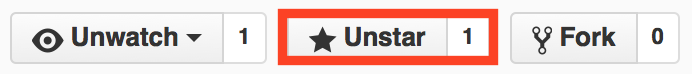

The final iOS calendar control you'll ever try


Inspiration for this control was made possible by Michael @ Karmadust. Want to know how the calendar control works inside out? [Check out his KDCalendar tutorial.](http://blog.karmadust.com/lets-create-a-calendar-using-a-uicollectionview/)


[](https://travis-ci.org/patchthecode/JTAppleCalendar) [](http://cocoapods.org/pods/JTAppleCalendar) [](http://cocoapods.org/pods/JTAppleCalendar) [](http://cocoapods.org/pods/JTAppleCalendar)

### **About Screenshots**
Much like a UITableView, because you can design this calendar to look however you want, screenshots will not be an accurate depiction of what this control looks like, but you can check out what people have developed with this control and also post you own images [at this link.](https://github.com/patchthecode/JTAppleCalendar/issues/2). A sample iOS application is also included in this project's [Github Repository](https://github.com/patchthecode/JTAppleCalendar) to give you an idea of what you can do.

* Downloaded it ?
* Tried it ?
* Then don't forget to leave a  on Github if you like it. It's needed to make this control #1 :)

### **Features**
---

- [x] Boundary dates - limit the calendar date range
- [x] Week/month mode - show 1 row of weekdays. Or 2, 3 or 6
- [x] Custom cells - make your day-cells look however you want, with any functionality you want
- [x] Custom calendar view - make your calendar look however you want, with what ever functionality you want
- [x] First Day of week - pick anyday to be first day of the week
- [x] Horizontal or vertical mode
- [x] Ability to scroll to any month by simply using the date
- [x] Ability to design your calendar [however you want.](https://github.com/patchthecode/JTAppleCalendar/issues/2) You want it, you build it
- [x] [Complete Documentation](http://cocoadocs.org/docsets/JTAppleCalendar)


### **Requirements**
---

* iOS 8.0+ 
* Xcode 7.2+


### **Communication on Github**
---
* Found a bug? [open an issue](https://github.com/patchthecode/JTAppleCalendar/issues)
* Got a cool feature request? [open an issue](https://github.com/patchthecode/JTAppleCalendar/issues)
* Need a question answered? [open an issue](https://github.com/patchthecode/JTAppleCalendar/issues) 


### **Installation using CocoaPods**

CocoaPods is a dependency manager for Cocoa projects. Cocoapods can be installed with the following command:

$ gem install cocoapods


> CocoaPods 0.39.0+ is required to build JTAppleCalendar

To integrate JTAppleCalendar into your Xcode project using CocoaPods, specify it in your Podfile:

```ruby
platform :ios, '8.0'
use_frameworks!

pod 'JTAppleCalendar'
```

Then, run the following command at your project location:

```bash
$ pod install
```

### **The Problem**
---

1. Apple has no calendar control.
2. Other calendar projects on Github try to cram every feature into their control, hoping it will meet the programmer's requirements.

This is an incorrect way to build controls. This leaves the developer with an extremely wide selection of (in many cases non-conventional) features that he has to sift through in order to configure the calendar. Also, no matter how wide the feature selection, the developer is always restricted to a predefined configuration-set shipped with the calendarControl.  Do you see Apple building their `UITableView` by guessing what they think you want the UITableView to look like? No. So neither should we. 

### **The Solution: JTAppleCalendar**
---

#### How to setup the calendar - Quick tutorial

JTAppleCalendar is similar to setting up a UITableView with a custom cell.


There are two parts
##### 1. The cell
---
Like a UITableView, the cell has 2 parts. 

* First let's create a new xib file. I'll call mine *CellView.xib*. I will setup the bare minimum; a single `UILabel` to show the date. It will be centered with Autolayout constraints. 

> Do you need more views setup on your cell like: dots, animated selection view, custom images etc? No problem. Design the cell however you want. This repository has sample code which demonstrates how you can do this easily.


* Second , create a custom class for the xib. The new class must be a subclass of `JTAppleDayCellView`. I called mine *CellView.swift*.  Inside the class setup the following:

```swift
    import JTAppleCalendar 
    class CellView: JTAppleDayCellView {
        @IBOutlet var dayLabel: UILabel!
    }
```

* Finally head back to your *cellView.xib* file and make the outlet connections.
- First,  select the view for the cell
- Second, click on the identity inspector
- Third, change the name of the class to one you just created: *CellView*
- Then connect your UILabel to your `dayLabel` outlet


##### 2. The calendarView
---
* This step is easy. Go to your Storyboard and add a `UIView` to it. Set the class of the view to be `JTAppleCalendarView`. Then setup an outlet for it to your viewController. You can setup your autolayout constrainst for the calendar view at this point.


##### Whats next?
Similar to UITableView protocols, your viewController has to conform to 2 protocols for it to work

* JTAppleCalendarViewDataSource

```swift
    // This method is required. You provide a startDate, endDate, and a calendar configured to your liking.
    func configureCalendar(calendar: JTAppleCalendarView) -> (startDate: NSDate, endDate: NSDate, calendar: NSCalendar)
```

* JTAppleCalendarViewDelegate

```swift
    // These methods are optional.
    // I tried to keep them as close to UITableView protocols as possible to keep them self descriptive

    func calendar(calendar : JTAppleCalendarView, canSelectDate date : NSDate, cell: JTAppleDayCellView, cellState: CellState) -> Bool
    func calendar(calendar : JTAppleCalendarView, canDeselectDate date : NSDate, cell: JTAppleDayCellView, cellState: CellState) -> Bool
    func calendar(calendar : JTAppleCalendarView, didSelectDate date : NSDate, cell: JTAppleDayCellView?, cellState: CellState) -> Void
    func calendar(calendar : JTAppleCalendarView, didDeselectDate date : NSDate, cell: JTAppleDayCellView?, cellState: CellState) -> Void
    func calendar(calendar : JTAppleCalendarView, didScrollToDateSegmentStartingWith date: NSDate?, endingWithDate: NSDate?) -> Void
    func calendar(calendar : JTAppleCalendarView, isAboutToDisplayCell cell: JTAppleDayCellView, date:NSDate, cellState: CellState) -> Void
```


##### Setting up the delegate methods
Lets setup the delegate methods in your viewController. I have called my viewController simply `ViewController`. Also, I prefer setting up my protocols on my controllers using extensions to keep my code neat, but you can put it where ever youre accustomed to. This function needs 3 variables returned. 
- Start boundary date 
- End boundary date 
- Calendar which you should configure to the time zone of your liking.

```swift
extension ViewController: JTAppleCalendarViewDataSource, JTAppleCalendarViewDelegate  {
    // Setting up manditory protocol method 
    func configureCalendar(calendar: JTAppleCalendarView) -> (startDate: NSDate, endDate: NSDate, calendar: NSCalendar) {
        // Assuming you have a: let formatter = NSDateFormatter() declared in your view controller.
        // The following demonstrates that you can provide dates both from NSDate() and NSDateFormatter()
        // For purposes of this tutorial, if you do not have a formatter declared, then simply supply what ever date you want or create a formatter now. Just make sure that the start date is less than the endDate.
        let firstDate = formatter.dateFromString("2016 01 05") 
        let secondDate = NSDate()
        let aCalendar = NSCalendar.currentCalendar() // Properly configure your calendar to your time zone here
        return (startDate: firstDate!, endDate: secondDate, calendar: aCalendar)
    }
}
```

Now that JTAppleCalendar knows its `startDate`, `endDate`, and `calendarFormat`, Let's setup up the protocol method to allow us to see the beautiful date cells we have designed earlier.

Just like UITableViewCell is about to be displayed on a tableView protocol method, so is this JTAppleDayCellView about to be displayed. We will now apply some custom configuration to our cell before it is displayed on screen. Add the following code to your extension. 

```swift
    func calendar(calendar: JTAppleCalendarView, isAboutToDisplayCell cell: JTAppleDayCellView, date: NSDate, cellState: CellState) {
        (cell as! CellView).setupCellBeforeDisplay(cellState, date: date)
    }
```

Now you have not declared the function `setupCellBeforeDisplay:date:` on your custom CellView class as yet, so let's head over to that class and implement it. Setup the following code shown below.

```swift
    import JTAppleCalendar

    class CellView: JTAppleDayCellView {
        @IBOutlet var dayLabel: UILabel!
            var normalDayColor = UIColor.blackColor()
            var weekendDayColor = UIColor.grayColor()


            func setupCellBeforeDisplay(cellState: CellState, date: NSDate) {
                // Setup Cell text
                dayLabel.text =  cellState.text

                // Setup text color
                configureTextColor(cellState)
            }

            func configureTextColor(cellState: CellState) {
                if cellState.dateBelongsTo == .ThisMonth {
                    dayLabel.textColor = normalDayColor
                } else {
                    dayLabel.textColor = weekendDayColor
            }
        }
    }
```

Your cell now has the ability to display text and color based on which day of the week it is. One final thing needs to be done. The Calender does not have its delegate and datasource setup.  Head to your `ViewController` class, and add following code:


```swift
    @IBOutlet weak var calendarView: JTAppleCalendarView! // Don't forget to hook up the outlet to your calendarView on Storyboard
    override func viewDidLoad() {
        super.viewDidLoad()
            self.calendarView.dataSource = self
            self.calendarView.delegate = self
            self.calendarView.registerCellViewXib(fileName: "CellView")
        }
```


#### Completed! Where to go from here?
---

Create all the other views on your xib that you need. Dots view, customWhatEverView etc. Then create the functionality of it just like you did in the example above.
If you're really out of ideas, using the same procedure above, why not try to create a background circular shaped SelectedView to appear when ever you tap on a date cell? You can also download the example project on Github and see the possibilities. 


#### Other properties/functions/structs to help configure your calendar


The following structure was returned when a cell is about to be displayed.

```swift
    public enum DateOwner: Int {
        case ThisMonth = 0, PreviousMonthWithinBoundary, PreviousMonthOutsideBoundary, FollowingMonthWithinBoundary, FollowingMonthOutsideBoundary
    }
```


* `.ThisMonth` = the date to be displayed belongs to the month section
* `.PreviousMonthWithinBoundary` = date belongs to the previous month, and it is within the date boundary you set
* `.PreviousMonthOutsideBoundary` = date belongs to previous month, and it is outside the boundary you have set
* `.FollowingMonthWithinBoundary` = date belongs to following month, within boundary
* `.FollowingMonthOutsideBoundary` = date belongs to following month, outside boundary


```swift
    public func changeNumberOfRowsPerMonthTo(number: Int, withFocusDate date: NSDate?) // After switching the number of rows shown, pick a date to autofocus on
    public func reloadData()
    public func scrollToNextSegment(animateScroll: Bool = true, completionHandler:(()->Void)? = nil) 
    public func scrollToPreviousSegment(animateScroll: Bool = true, completionHandler:(()->Void)? = nil)
    public func scrollToDate(date: NSDate, animateScroll: Bool = true, completionHandler:(()->Void)? = nil)
    public func selectDates(dates: [NSDate], triggerSelectionDelegate: Bool = true)
    public func cellStatusForDateAtRow(row: Int, column: Int) -> CellState?
```

#### Properties you can configure
```swift
// Note: You do not need to configure your calendar with this if it is already the default
calendarView.direction = .Horizontal                       // default is horizontal
calendarView.numberOfRowsPerMonth = 6                      // default is 6
calendarView.cellInset = CGPoint(x: 0, y: 0)               // default is (3,3)
calendarView.allowsMultipleSelection = false               // default is false
calendarView.bufferTop = 0                                 // default is 0. - still work in progress
calendarView.bufferBottom = 0                              // default is 0. - still work in progress
calendarView.firstDayOfWeek = .Sunday                      // default is Sunday
calendarView.scrollEnabled = true                          // default is true
calendarView.pagingEnabled = true                          // default is true
calendarView.scrollResistance = 0.75                       // default is 0.75 - this is only applicable when paging is not enabled
```

Do you have any other questions?. If you are trying to bend heaven and earth to do something complicated with this calendar, then chances are there is already an easy way for it to be done. So [Opening an issue](https://github.com/patchthecode/JTAppleCalendar/issues/new) might be a good idea.

Did you remember to leave a like? I would really appreciate it if you did. 

Other functions/properties are coming. This is a very active project.


JTAppleCalendar is available through [CocoaPods](https://cocoapods.org/pods/JTAppleCalendar). To install
it, simply add the following line to your Podfile:

```ruby
pod 'JTAppleCalendar', '~> 2.1.2'
```

## Author

JayT, patchthecode@gmail.com

## License

JTAppleCalendar is available under the MIT license. See the LICENSE file for more info.
